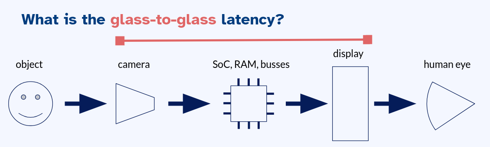
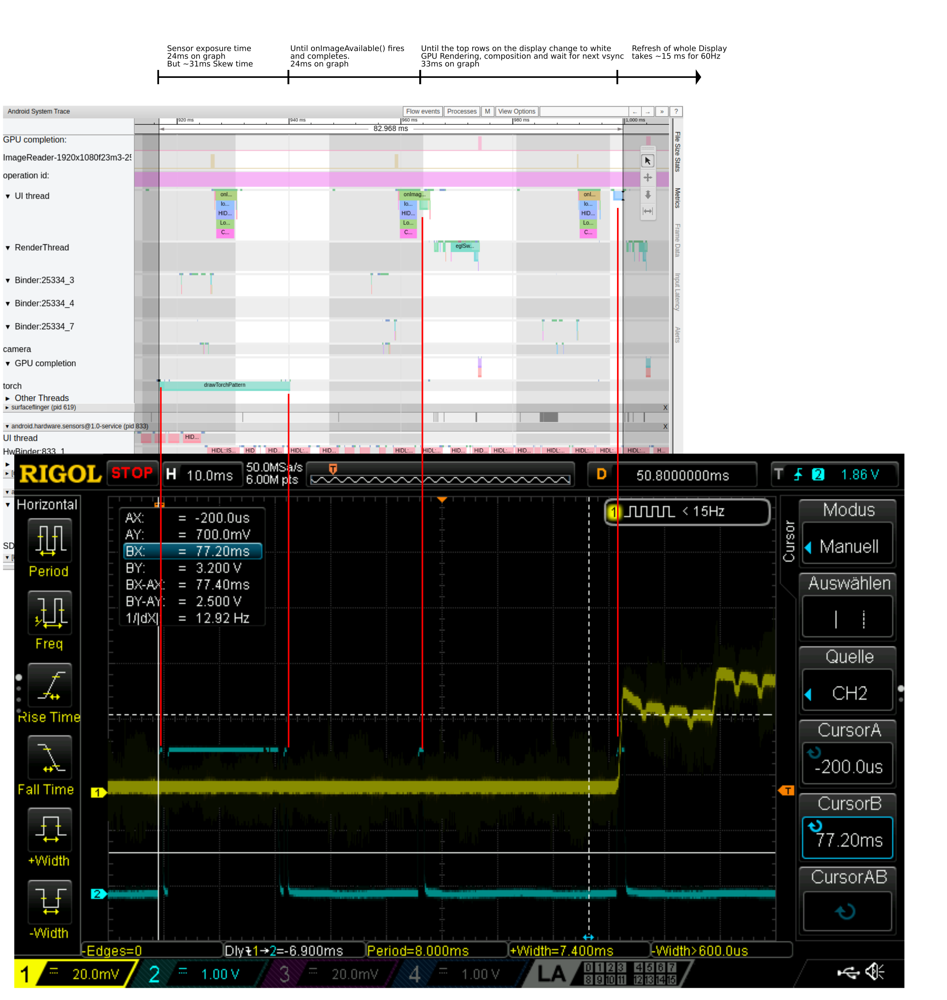

# Android - Glass to glass latency

This repo is a collection of tests and code that were used to investigate the
glass to glass latency on an Android smartphone.

What is the glass-to-glass latency? If you have a device with a camera and a
display, like a smartphone or a camcorder, the glass to glass latency is the time
between capturing a image by the camera and showing frame on the display again.
It's the time between the class of the camera and glass of the display.

# Usage

The code in this repo is not expected to work as-is, or even compiled and
deployed to an Android device. The repo is a treasure trove of snippets and
ideas to look at. You can copy&paste maybe some code lines or files, but it
should the base for your own experiments: Just look and read, don't execute.

# Nice bits and pieces

These things maybe interesting:

A [MilliSecondsClock](./app/src/main/java/de/inovex/latencytest/MilliSecondsClock.java)
that tries to be precises as possible. It uses Androids
[Choreographer](https://developer.android.com/reference/android/view/Choreographer)
to update the time for every frame that the displays shows at 60hz.

A [FlashToggleSpeedFaster class](app/src/main/java/de/inovex/latencytest/FlashToggleSpeed.java)
and a [FlashToggleSpeedFaster class](app/src/main/java/de/inovex/latencytest/FlashToggleSpeedFaster.java)
to test how fast the flash light (=torch light) and be toggled from an app/userspace.
I used the flash light as a synchronization mechanism between the software/app
and the external measurements with an oscilloscope.

A [CameraToDisplay class](app/src/main/java/de/inovex/latencytest/CameraToDisplay.java)
that can use three different backends: an ImageReader, a Texture View and
SurfaceView. If found not latency differences between these three backends.

The folder [pixeltorch](pixeltorch/) contains a C library to switch the torch
light (also used as a flash for the rear camera) of the Pixel2 on and off.
It was extract and reverse engineered from the camera HAL of the Pixel2.
The Java implementation starts here:
[PixelTorch.java](app/src/main/java/de/inovex/latencytest/PixelTorch.java)

# Talk

This repository was mentioned in the talk ...

TODO add content of this section
TODO add slides!

# History

I did this investigation in 2022 to understand the latency and the inner
workings of the Android graphics subsystem.

The result of the investigation is summarized by a single systrace graph and
oscilloscope screenshot:

# Maybe some useful notes

My code and tests were don't on a rooted device. It was flashed with a vaniall
AOSP build in 'userdebug' mode. Using ioctls to control the torch light
from an app only works, when you disable a lot of security checks:

    $ adb root
    $ adb shell chmod o+rw /dev/v4l-subdev12
    $ adb shell setenforce permissive   # disable seLinux

To download an image from the example app, I used the follow commands

    adb shell run-as de.inovex.latencytest cat /data/user/0/de.inovex.latencytest/files/image0.jpeg > image0.jpeg

Some of my traces were done with the command:

    $ ~/Android/Sdk/platform-tools/systrace/systrace.py \
        --atrace-categories=sched,gfx,hal,irq,ion,camera,sm --time=2 \
        -o systrace.html  -a de.inovex.latencytest
