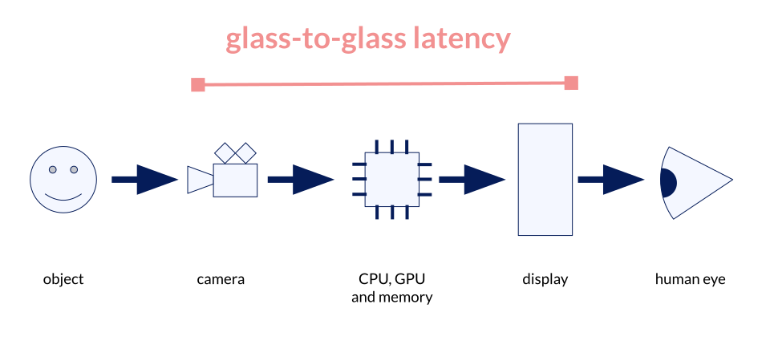

# Android - Glass-to-glass latency

This repo is a collection of tests and code that were used to investigate the
glass-to-glass latency on an Android smartphone.

What is the glass-to-glass latency? If you have a device with a camera and a
display, like a smartphone or a camcorder, the glass-to-glass latency is the
time between capturing an image by the camera and showing the frame on the
display again.  It's the time between the class of the camera and the glass of
the display.

# Usage

The code in this repo is not expected to work as-is, or even compiled and
deployed to an Android device. The repo is a treasure trove of snippets and
ideas to look at. You can copy&paste maybe some code lines or files, but it
should be the base for your own experiments: Just look and read, don't execute.

# Nice bits and pieces

These things maybe interesting:

A [MilliSecondsClock](./app/src/main/java/de/inovex/latencytest/MilliSecondsClock.java)
that tries to be precisely as possible. It uses Android's
[Choreographer](https://developer.android.com/reference/android/view/Choreographer)
to update the time for every frame that the displays shows at 60hz.

A [FlashToggleSpeedFaster class](app/src/main/java/de/inovex/latencytest/FlashToggleSpeed.java)
and a [FlashToggleSpeedFaster class](app/src/main/java/de/inovex/latencytest/FlashToggleSpeedFaster.java)
to test how fast the flash light (=torch light) can be toggled from an app/userspace.
I used the flash light as a synchronization mechanism between the software/app
and the external measurements with an oscilloscope.

A [CameraToDisplay class](app/src/main/java/de/inovex/latencytest/CameraToDisplay.java)
that can use three different backends: an ImageReader, a Texture View and
SurfaceView. If found no latency differences between these three backends.

The folder [pixeltorch](pixeltorch/) contains a C library to switch the torch
light (also used as a flash for the rear camera) of the Pixel2 on and off.
It was extracted and reverse engineered from the camera HAL of the Pixel2.
The Java implementation starts here:
[PixelTorch.java](app/src/main/java/de/inovex/latencytest/PixelTorch.java)

# Talk

This repository was mentioned in the talk *Adventures with Systrace - Measure
and investigate the glass-to-glass latency in Android*. I held the talk
at [The AOSP and AAOS November meetup](https://www.meetup.com/the-aosp-and-aaos-meetup/events/296399142/).

The meetup homepage is
[The AOSP and AAOS Meetup](https://aospandaaos.github.io/#the-november-2023-meetup).
You can find the link to the [slides](https://2net.co.uk/slides/aosp-aaos-meetup/2023-november-slengfeld-glass-to-glass-latency.pdf)
and the [video](https://youtu.be/NKP4JcVegbY) on the meetup's homepage.
And here is a backup of the [slides](talk/Talk_Stefan-Lengfeld_glass-to-glass-latency-in-Android.v1.pdf)
committed in this repo.

# History

I did this investigation in 2022 to understand the latency and the inner
workings of the Android graphics subsystem.

The result of the investigation is summarized by a single systrace graph and
oscilloscope screenshot:

# Maybe some useful notes

My code and tests were done on a rooted device. It was flashed with vanilla
AOSP build in `userdebug` mode. Using ioctls to control the torch light
from an app only works, when you disable a lot of security checks:

    $ adb root
    $ adb shell chmod o+rw /dev/v4l-subdev12
    $ adb shell setenforce permissive   # disable seLinux

To download an image from the example app, I used the follow commands

    adb shell run-as de.inovex.latencytest cat /data/user/0/de.inovex.latencytest/files/image0.jpeg > image0.jpeg

Some of my traces were done with the command:

    $ ~/Android/Sdk/platform-tools/systrace/systrace.py \
        --atrace-categories=sched,gfx,hal,irq,ion,camera,sm --time=2 \
        -o systrace.html  -a de.inovex.latencytest
